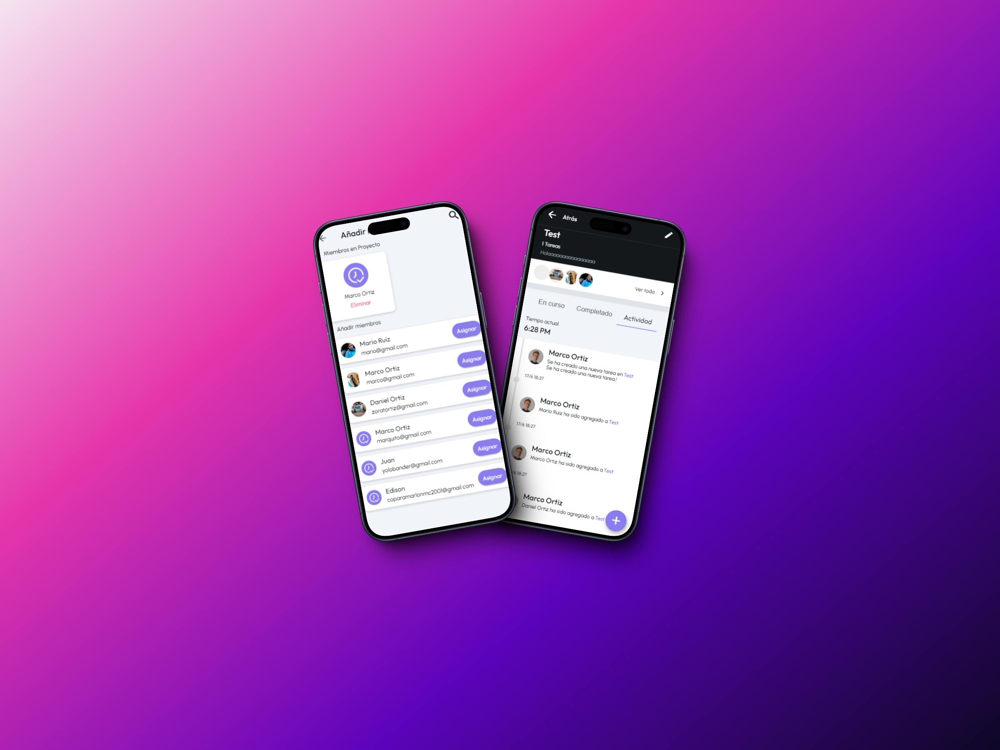

# ProjeXpert



Este proyecto consiste en el desarrollo de una **Aplicación móvil para gestión de proyectos**. Organiza y supervisa tus proyectos con facilidad. Asigna tareas, establece plazos, colabora con tu equipo y realiza un seguimiento del progreso en tiempo real.

## Guía de Implementación del Proyecto 🚀

### Requisitos Previos

Asegúrese de tener instalados los siguientes elementos antes de proceder:

- **[Node.js](https://nodejs.org/):** Asegúrese de tener instalada la versión 18.17.0 de Node.js.
  
  
  **Instalación de Node.js:**
  - Descargue e instale Node.js desde [https://nodejs.org/](https://nodejs.org/).
  - Verifique la instalación ejecutando los siguientes comandos:
    ```bash
    node -v
    npm -v
    ```

- **[npm](https://www.npmjs.com/):** Asegúrese de tener instalada la versión 9.6.7 de npm.
  
  
  **Instalación de npm:**
  - npm se instala automáticamente con Node.js. Verifique la versión ejecutando el siguiente comando:
    ```bash
    npm -v
    ```

- **[Flutter](https://flutter.org/):** Asegúrese de tener instalado Flutter, caso contrario seguir los siguientes pasos:


### Instalación de Flutter

Para desarrollar la aplicación móvil usando Flutter, siga estos pasos:

1. **Instalación de Flutter SDK**

   - Descargue e instale el SDK de Flutter desde el sitio web oficial de [Flutter](https://flutter.dev/).

2. **Configuración del entorno**

   - Añada la ruta del SDK de Flutter al PATH de su sistema para acceder a los comandos de Flutter desde cualquier ubicación en su terminal.

     ```bash
     export PATH="$PATH:<ruta_al_directorio_flutter>/flutter/bin"
     ```

     Reemplace `<ruta_al_directorio_flutter>` con la ubicación real donde descomprimió el SDK de Flutter.

3. **Verificación de la Instalación**

   - Ejecute el siguiente comando para verificar que Flutter esté correctamente instalado:

     ```bash
     flutter doctor
     ```

     Este comando también guiará en la instalación de cualquier dependencia faltante necesaria para el desarrollo con Flutter.

### Creación y Ejecución de la Aplicación Flutter

1. **Creación de la Aplicación**

   - Cree una nueva aplicación Flutter con el siguiente comando:

     ```bash
     flutter create mi_aplicacion
     ```

     Reemplace `mi_aplicacion` con el nombre deseado para su nueva aplicación.

2. **Acceso al Directorio de la Aplicación**

   - Navegue al directorio de la aplicación recién creada:

     ```bash
     cd mi_aplicacion
     ```

3. **Ejecución de la Aplicación**

   - Compile y ejecute la aplicación en un emulador o dispositivo conectado:

     ```bash
     flutter run
     ```

     Este comando iniciará la aplicación en el dispositivo/emulador seleccionado.


## Instrucciones de Instalación

1. Clonar el Repositorio:
git clone https://github.com/MarcoOrtiz333/ProjeXpert.git


2. Acceder al Directorio del Proyecto:
cd VitMap


3. Instalar Dependencias:
npm install

4. Ejecutar la Aplicación:
npm start


------------

# Construido con 🛠️

Este proyecto ha sido configurado utilizando las siguientes herramientas y tecnologías:

- [Flutter](https://docs.flutter.dev/) - SDK de código fuente abierto de desarrollo de aplicaciones móviles creado por Google.
- [Firebase](https://firebase.google.com/) - Plataforma de desarrollo de aplicaciones móviles y web.
- [Asana](https://asana.com/es) - Herramienta de seguimiento de problemas y gestión de proyectos.
- [Node.js](https://nodejs.org/) - Entorno de ejecución para JavaScript.

Además, el proyecto utiliza configuraciones específicas para el manejo de dependencias y la construcción de la aplicación con Flutter. Puedes encontrar detalles en el archivo de configuración del proyecto.

-----

# Autores ✒️

El proyecto fue posible gracias a la contribución de las siguientes personas:

- **Marco Ortiz** - Desarrollador FullStack - [Marco Ortiz](https://github.com/MarcoOrtiz333)
------

# Capturas de Pantalla 📸

A continuación, se presentan algunas capturas de pantalla de la aplicación **VitMap**:

# Pantalla Principal


# Miembros del Proyecto


# Actividades del Proyecto


------

Agradecemos a todos los [contribuyentes](#autores) que han participado en este proyecto. 🌟

